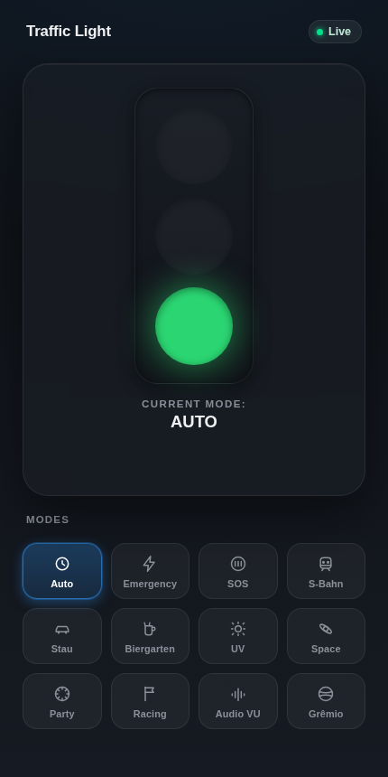
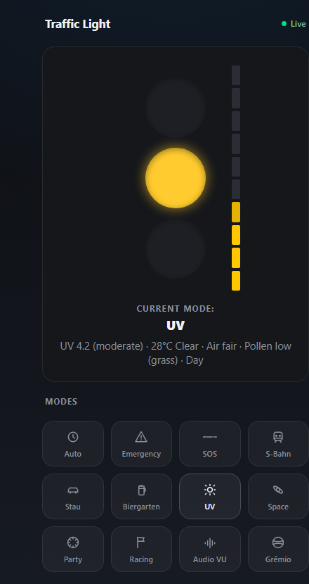
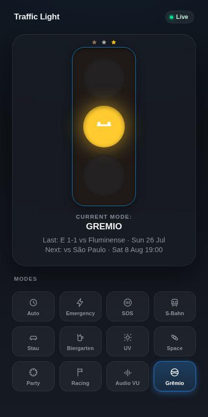

# Traffic Light

A Raspberry Pi wired to three real LEDs, built to answer the one question
that actually matters: is it fine, is it about to not be fine, or is it
already on fire. Trains, UV rays, solar storms, football, your rev
limiter, doesn't matter what's actually wrong, it all boils down to red,
yellow, or green in the end.

<p align="center">
  
  
  
</p>

## What it does

- 12 modes, each an excuse to light up red/yellow/green for a different
  reason, trains, traffic, weather, UV, solar storms, a microphone, your
  football team's feelings, or a sim racing rig. Table below.
- A little segmented bar next to the lights for modes with a real number
  behind them, so you get more than three levels of "eh."
- Grêmio mode gets its own face. Happy, neutral, or furious, depending on
  the last result. This project has its priorities in order.
- Updates push to the browser over Server-Sent Events instead of polling,
  because even a novelty desktop light deserves not to murder your
  phone's battery.
- One Python file. No framework, no build step, no npm anywhere near this.
- A SimHub plugin lives in [`simhub-plugin/`](simhub-plugin) so iRacing
  can yell at the lights directly, flags, or a live shift-light rev bar,
  over UDP.

## Modes

| Mode | Lights up for | Needs |
|---|---|---|
| Auto | A fixed cycle, for when you just want a metronome |, |
| Manual | Whatever you tap in the UI |, |
| Emergency | Blinking yellow |, |
| SOS | Morse SOS, for when it's actually that bad |, |
| S-Bahn | Minutes to your next train | Deutsche Bahn API keys |
| Stau | How bad your commute is right now | TomTom or Google Maps key |
| Biergarten | Temperature / weather / time of day | OpenWeatherMap key |
| UV | Current UV index |, |
| Space | Geomagnetic Kp index (aurora/storm risk) |, |
| Party | Random color flicker, no logic, no reason |, |
| Racing | Live flags + rev bar from iRacing, via [`simhub-plugin/`](simhub-plugin) | the plugin, UDP → port 9001 |
| Audio VU | Mic level | a USB mic |
| Grêmio | Last match result |, (ESPN) |

No API key, no drama, those modes just sit there looking pretty instead
of doing anything useful.

## Hardware

Three LEDs (or a relay board) on the Pi's GPIO, active-low: Red on 22,
Yellow on 27, Green on 17. Change pins/polarity at the top of
`traffic_light_single.py`. No Pi, no wiring, wrong pins, it quietly
switches to fake hardware so the web UI still works and lies to you
gracefully.

## Running the Pi side

```bash
git clone https://github.com/tiagofranzen/pi-traffic-light.git
cd pi-traffic-light
pip install -r requirements.txt   # add --break-system-packages if Raspberry Pi OS is feeling precious
python3 traffic_light_single.py
```

Open `http://<pi-ip>:8000`. Add it to your phone's home screen if you
want to pretend it's a real app.

Optional environment variables, only needed for the modes that ask for a
key above: `DB_CLIENT_ID` / `DB_CLIENT_SECRET`, `OWM_API_KEY`,
`TOMTOM_API_KEY` (or `GOOGLE_MAPS_API_KEY` as a fallback),
`AUDIO_INPUT_DEVICE`.

## Running the SimHub side

[`simhub-plugin/`](simhub-plugin) is a full SimHub plugin project (.NET
Framework 4.8, C#, Visual Studio). Open
`simhub-plugin/Traffic_Light_Plugin.sln`, build it, restart SimHub,
enable "Traffic Light Plugin (Flags & Revs)" in the plugins list, point
it at your Pi's IP and port `9001`. Pick flag mode or rev-light mode in
the settings panel and go find out how far past redline you actually
are.

## API

- `GET /`, the web UI
- `GET /status`, current state as JSON
- `GET /events`, same state as an SSE stream (what the UI actually uses)
- `GET /?action=set_mode&mode=<name>`, switch mode
- `GET /?action=set_color&color=<red|yellow|green>`, manual override

## License

MIT, see [LICENSE](LICENSE). Do whatever you want with it, it's a box
that turns on lights.